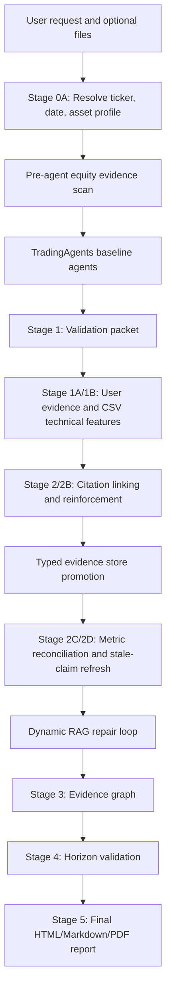

# TradingAgents TITAN Integration

[](#current-capability)
[](LICENSE)
[](https://github.com/TauricResearch/TradingAgents)
[](#research-only-disclaimer)

**Built by a real trader for passionate traders worldwide, shaped by the hard
lessons only live markets can teach.**

TradingAgents TITAN Integration is an independent, evidence-first research
governance wrapper around the open-source
[TradingAgents](https://github.com/TauricResearch/TradingAgents) framework. It
keeps the original multi-agent research engine upgradeable, then adds a
production-minded evidence layer: source retrieval, validation, graphing,
auditing, horizon checks, and institution-style final reporting.

This is not a copy-paste fork. It is a trader-led, feature-rich evolution of the
original idea: TradingAgents supplies the multi-agent research foundation;
TITAN adds the discipline required to turn agent narratives into traceable,
timestamped, evidence-gated decision-support reports.

## Attribution

Full credit to **TauricResearch and the original TradingAgents authors** for the
upstream framework and research paper.

- Upstream repository: <https://github.com/TauricResearch/TradingAgents>
- Research paper: <https://arxiv.org/abs/2412.20138>
- Upstream license verified for this publication pass: `Apache-2.0`
- Local attribution file: [NOTICE.md](NOTICE.md)

This repository is an independent integration wrapper. It is not affiliated
with, endorsed by, or sponsored by TauricResearch unless explicitly stated by
the upstream maintainers.

## What The Original Project Provides

The upstream TradingAgents project provides a multi-agent LLM financial trading
research framework with analyst, researcher, trader, risk, and portfolio
manager roles. It is the agentic research engine that inspired and powers the
baseline workflow used by this wrapper.

## What This Enhanced Version Adds

This repository adds a global TITAN governance layer around TradingAgents:

- **Titan OS 2.9 / Titan DTP 1.6 aligned governance concepts** implemented as
  wrapper-layer evidence discipline. Private TITAN corpora are not included in
  the public repository.
- **Stage 0A request resolution** for ticker, asset profile, input folders, and
  analysis date.
- **Mandatory equity evidence scan** before agent synthesis.
- **Dynamic hybrid RAG** using provider/API retrieval, issuer IR, SEC,
  reputable news, specialist aggregators, web discovery, extraction retry, and
  source reconciliation.
- **Typed evidence store** with source URLs, source ranks, timestamps,
  limitations, retrieved/partial/stale/invalid statuses, and do-not-claim
  constraints.
- **Issuer and SEC deep-read promotion** so cited IR pages, filings, earnings
  releases, and transcripts are read for facts such as RPO, OCF, CapEx,
  guidance, and earnings metrics.
- **SEC cash-flow extraction** for latest operating cash flow and CapEx, with
  central FCF calculation.
- **Earnings-event resolver** that separates latest reported earnings from next
  estimated earnings and quarantines stale dates.
- **Actual-vs-consensus classifier** to prevent false "miss" or
  "disappointment" language.
- **CapEx, FCF, forward P/E, short-interest, options, analyst-consensus, and
  ownership/Form 4 gates** enforced in Python.
- **Five-round Bull/Bear debate validation** with semantic round checks.
- **Research Manager, Trader, Risk, and Portfolio Manager sanity gates** so
  final decisions do not silently inherit contaminated consensus.
- **Operational learning loop** that records rejected claims by agent role and
  evidence dependency, then injects relevant lessons into future runs.
- **User evidence ingestion** for optional documents, screenshots, and
  multi-timeframe CSV technical evidence.
- **Evidence graph generation** for source, claim, metric, gap, horizon, and
  final-decision traceability.
- **Stage 5 institutional report renderer** producing HTML, Markdown, and PDF.
- **Publication safety checks** to keep private data, generated reports,
  provider caches, secrets, and local corpora out of GitHub.

## Current Capability

Implemented and tested:

- `Equity v1`

Registered but not yet implemented:

- `ETF`
- `Index`
- `Equity-Option`
- `ETF-Option`
- `Index-Option`
- `Crypto`
- `FX`
- `Futures`
- `Commodity`
- `CFD`

Unsupported asset profiles stop gracefully. The system must not pretend equity
logic is complete commodity, CFD, FX, crypto, futures, ETF, index, or options
research.

## Architecture



In plain English:

1. The user gives a ticker and optional files.
2. The system determines the right asset profile and folder structure.
3. The evidence layer retrieves market, filing, earnings, guidance, technical,
   sentiment, valuation, and positioning facts.
4. TradingAgents generate the baseline debate and research narrative.
5. TITAN validates every important claim against typed evidence.
6. Missing or invalid facts trigger dynamic retrieval and source reconciliation.
7. The graph layer maps sources, claims, metrics, gaps, and decisions.
8. The final report is rendered from accepted evidence, caveated scenarios, and
   explicit limitations.

## Direct User Interfaces

Codex is used during development, but it is not the production user interface.

Direct execution paths today:

- PowerShell plus Python/`uv` commands.
- `scripts\run_tradingagents_baseline.py` for the TradingAgents baseline.
- `scripts\build_stage*.py` for TITAN stages.
- Static Stage 5 HTML, Markdown, and PDF reports.

There is no committed HTTP API or web application endpoint yet. A future API or
UI should call the same generic pipeline modules used by the CLI so CLI and API
behavior remain identical.

See [docs/direct-user-interface-and-deployment-path.md](docs/direct-user-interface-and-deployment-path.md).

## Installation

Open Windows PowerShell:

```powershell
cd D:\Projects\CodeX\TradingAgents_Integration
```

Install/sync the upstream TradingAgents environment:

```powershell
cd D:\Projects\CodeX\TradingAgents_Integration\TradingAgents
uv sync
```

Return to the wrapper root for TITAN commands:

```powershell
cd D:\Projects\CodeX\TradingAgents_Integration
```

Copy the example environment file:

```powershell
Copy-Item .env.example .env
```

Add credentials only to ignored local `.env` files. Never commit live keys.

## Configuration

Important local settings:

- `DEEPSEEK_API_KEY` for DeepSeek-backed baseline runs.
- `SEC_EDGAR_USER_AGENT` for SEC EDGAR requests.
- Optional provider keys for future paid/enriched feeds.

Stooq note: Stooq does **not** provide an official documented public API with
API keys. Any Stooq use should be treated as unofficial CSV/scraping-style
fallback access, not an institutional primary source.

## Running The Workflow

The full business-user manual is here:

- [docs/USER_MANUAL_STAGE0A_TO_STAGE5.md](docs/USER_MANUAL_STAGE0A_TO_STAGE5.md)

Typical pattern:

```powershell
cd D:\Projects\CodeX\TradingAgents_Integration
```

Run Stage 0A:

```powershell
uv run python scripts\build_stage0a_research_resolution.py `
  --ticker MSFT `
  --full-name "Microsoft Corporation" `
  --instrument-type Equity `
  --asset-class Equity `
  --analysis-date 2026-05-04 `
  --input-folder inputs\MSFT\2026-05-04
```

Run the final export after the intermediate stages are built:

```powershell
uv run python scripts\export_stage5_v2_final_report.py `
  --ticker MSFT `
  --trade-date 2026-05-04 `
  --run-id MSFT_YYYYMMDDTHHMMSSZ
```

## Input Folder Policy

User files are local-only and ignored by Git:

```text
inputs\<TICKER>\<ANALYSIS_DATE>\
```

Supported supplemental inputs:

- CSV technical datasets.
- Screenshots.
- Supporting documents.
- User-supplied evidence notes.

CSV files are optional. If supplied, they supplement TITAN addenda. If absent,
the system retrieves comparable market and technical evidence from provider and
public-source paths.

For normal local development, keep private ticker files and generated research
artifacts in the working tree where the workflow expects them. They are
protected by `.gitignore` and must remain ignored:

- `TradingAgents\`
- `inputs\<TICKER>\...`
- `outputs\`
- `research_packets\`
- `research_cycles\`
- `research_materials\`
- `normalized_data\`
- `provider_cache\`
- `assets\`

Before every GitHub push, run the publication safety check. Files shown by
`git status --short --ignored` with `!!` are ignored and are not pushed.

`D:\Projects\CodeX\TradingAgents_Integration_Data\` may still be used as an
optional backup/archive folder, but it is not required for day-to-day work.

## Output Locations

Generated outputs are local-only and ignored by Git:

- Final reports: `research_packets\stage5_final_report\<RUN_ID>\`
- Evidence graph: `research_packets\stage3_graphify\`
- Stage packets: `research_packets\stage*\`
- Archived cycles: `research_cycles\<RUN_ID>\`
- Provider cache: `provider_cache\`

## Evidence Governance

The guiding rule is simple: **facts must be found, validated, timestamped, and
typed before they become final truth.**

The system enforces:

- Persistent retrieval before declaring data unavailable.
- Source hierarchy and source-permission checks.
- Temporal guards against future-dated citation errors.
- Numeric artifact rejection.
- Stale catalyst quarantine.
- Claim-level validation instead of whole-section deletion.
- Constrained conclusions when evidence remains incomplete.

## Evidence Graph

Stage 3 generates a graph of:

- sources
- claims
- evidence keys
- metrics
- gaps
- horizons
- final-decision dependencies

The latest MSFT graph refresh was run against the updated Stage 1 through Stage
5 artifacts and includes the latest MSFT filing/evidence promotion path.

## GitHub Publication Safety

Before any push:

```powershell
python scripts\publication_safety_check.py
```

The public candidate must include only wrapper code, documentation, safe
examples, and attribution files. It must exclude:

- `.env` files
- API keys or credentials
- user CSVs, screenshots, or documents
- private TITAN corpora
- generated research packets
- generated reports
- provider caches
- nested upstream `TradingAgents/`
- local graph outputs and archived cycles

## Verification

Recommended final checks:

```powershell
python -B -m compileall -q scripts titan_integration TradingAgents\tradingagents
cd TradingAgents
uv run pytest -q
cd ..
python scripts\publication_safety_check.py
```

Latest local verification during this publication-prep pass:

- Full tests: `185 passed, 42 subtests passed`
- Publication safety check: passed

## Research-Only Disclaimer

This software is for research and decision-support workflow experimentation
only. It is not financial advice, investment advice, trading advice, tax
advice, legal advice, accounting advice, brokerage advice, or a solicitation or
recommendation to transact. It does not place trades and does not connect to
live brokerage execution.
